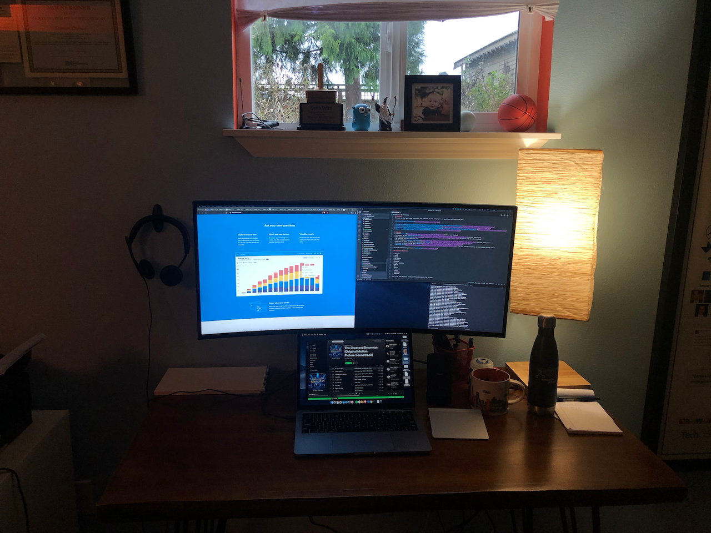

# dacort/is-remote

I'm now a remote employee. This is a new adventure for me and I thought it could be interesting to document my journey. 

I plan to keep this doc up-to-date with the equipment I use and challenges I face.

## Overview

I'm brand new to being remote - usually when I've done so before, it's just been out of a coffee shop with me and my laptop.
But with being fully remote I feel the need to upgrade some of my equipment.

I have an office basement (cold) with small windows (minimal sunlight) in Seattle (minimaler sunlight), so there are a variety of things I'm looking into to make my daily experience better. :smile:

I've purchased most of this on Amazon and have included relevant, but affiliate, links as an FYI. 

## Equipment

### Tech

- Compute - MacBook Pro (13-inch, 2017). Dual core 3.5 GHz i7, 16GB RAM
- iPhone holder/power - [Anker Wireless Charger, PowerWave 7.5 Stand](https://amzn.to/2qLYfhs) + [Anker Charge 3.0](https://amzn.to/36oGKms)
- Headset - [Plantronics Blackwire C520-M](https://amzn.to/2rDFRHP)
  - Not my favorite, but came free :man_shrugging:
- Webcam - [Logitech C920S](https://amzn.to/2S7INWr)
- ~~Laptop stand - [Griffin GC16034](https://amzn.to/2PAqBn7)~~
- ~~Keyboard - [Apple Magic Keyboard](https://www.apple.com/shop/product/MLA22LL/A/magic-keyboard-us-english)~~
- Trackpad - [Apple Magic Trackpad 1](https://www.apple.com/shop/product/MJ2R2LL/A/magic-trackpad-2-silver)
  - Link is to the newer Trackpad...I bought mine several years ago.

### Office

- Desk - ["Live Edge" Desk from Target](https://www.target.com/p/remington-live-edge-desk-natural-christopher-knight-home/-/A-53630772)
- Chair - [Space Air Grid Series High Back Chair with Headrest](https://amzn.to/36uyuBd)
  - I don't think it's that exact one, I got it from a friend...
- Monitor - [Dell U3419w Ultrasharp 34-Inch Curved Monitor](https://amzn.to/2MQAQTJ)
- Desk Lamp - [Adesso w/fabric shade](https://amzn.to/2QhMObf) + [Kasa KL110 Smart bulb](https://amzn.to/35jGhRE) (for optimal daylight hues)

### Personal

- Slippers - [Glerups felt slippers](https://www.glerups.com/products/ladies-gents/the-slip-on-with-leather-sole/orange/)
  - My basement gets cold
- H2O - [Travel Berkey Water Filter](https://amzn.to/2PwWqNE) and [SodaStream](https://amzn.to/2LHxAcD) for sparkly water!

## Changelog

- 2019-01-01
    - Added new monitor (:raised_hands:) and removed laptop stand and external keyboard. 
    - Added Kasa smart light bulb (:bulb:), which has a fantastic feature that matches natural light patterns from dawn to dusk.
